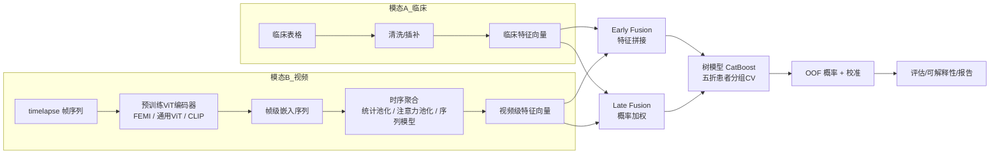

# 多模态胚胎活产概率预测 —— 执行计划（PLAN）

> 目标：输入 **临床表格**（移植前可获得）+ **胚胎培养第 1–5 天 timelapse 视频**，输出移植后 **活产（Live Birth）概率**。
> 本计划是独立设计，仅参考 `instruct.md` 的数据结构与任务背景，不照搬其 step01–12 脚本框架。

---

## 1. 任务定义

| 项 | 说明 |
|---|---|
| 预测目标 | LB（活产）：移植后最终活产概率 $P(\text{LB}=1 \mid \text{clinical}, \text{video})$ |
| 输入模态 1 | 临床表格：年龄、BMI、基础 FSH/LH/E2、AMH、Gn 总量、内膜厚度等 10 个移植前数值特征 |
| 输入模态 2 | timelapse 视频：胚胎从受精到第 5 天（囊胚）的延时摄影帧序列 |
| 单位样本 | 一枚胚胎（患者可能有多枚胚胎 → 需要按患者分组，防泄漏） |
| 输出形式 | 每个样本一个 $[0,1]$ 概率 + 校准区间 |
| 评估指标 | **AUROC**（排序能力）+ **AUPRC**（不平衡下的真实排序能力）+ 校准度（Brier / ECE） |

### 核心约束：时间一致性（防泄漏红线）
- 所有特征必须**在移植前可获得**：
  - 临床特征 → 仅用移植前采集的指标
  - 视频特征 → 只使用培养 **D1–D5** 的帧，**禁止**使用任何移植后信息
- 同一患者的多枚胚胎 → **按患者分组交叉验证**（`StratifiedGroupKFold`），同一患者的胚胎不能同时出现在训练和验证集。

---

## 2. 数据理解与假设

工作区当前 `data/` 为空，以下为**预期数据结构**（与 instruct.md 描述对齐，拿到真实数据后以实际为准）：

```
data/
├── raw/
│   ├── clinical_table.csv            # 患者-胚胎级临床记录
│   │    必需列: patient_id, embryo_no, FH, LB, 10 个临床特征
│   ├── video_matches.csv             # 胚胎 → 视频/帧目录 匹配表
│   └── video/                        # 每个胚胎一个目录，内含按时间排序的帧图
│         └── <embryo_id>/frame_0001.jpg ...
├── processed/                        # 中间产物（脚本自动生成）
└── external/                         # FEMI 等预训练权重缓存
```

**数据质量预设问题**（拿到数据后逐一核实）：
- 临床表脏数据（非数值/空字符串）→ 容错转 NaN
- 同患者多胚胎、重复 `patient_embryo_key`
- 视频帧数不齐、帧缺失、目录结构与匹配表不一致
- 标签缺失（未移植/结局未知的胚胎）

---

## 3. 方法论架构

整体采用 **"预训练视觉编码器 → 时序聚合 → 与临床特征融合"** 的分层方案：



### 三套融合策略（系统对比，回答"视频特征能否提升纯临床基线"）

| 策略 | 做法 | 特点 |
|---|---|---|
| **Baseline** | 仅临床特征 → 树模型 | 参考下限，必须最先做 |
| **Early Fusion** | 临床 + 视频特征拼接 → 树模型 | 简单有效，特征交互交给树 |
| **Late Fusion** | 临床模型与视频模型各自预测 → 概率加权（权重用验证集网格搜索） | 解耦两模态，可解释 |
| **Stacking**（进阶） | 两模态模型输出概率 + 特征 → 元学习器（LR / CatBoost） | 通常最优，但需防元特征泄漏 |

### 视频特征提取方案（多选消融）

1. **编码器选择**：优先 FEMI（胚胎域预训练 ViT）；备选通用 ViT / CLIP 做消融对比，验证"域预训练是否必要"
2. **帧级嵌入**：ViT 输出去 CLS token 后对 patch 做均值池化（`hidden[:, 1:, :].mean(dim=1)`），推理时关 MAE mask
3. **时序聚合**：
   - 简单统计池化：`mean / std / delta(后-前) / last`（先做，稳健）
   - 进阶：注意力池化 / GRU 序列模型（若样本量足够再做，防止过拟合）
4. **降维**：视频特征若维度过高 → `SimpleImputer → StandardScaler → PCA`，**PCA 必须在每折训练集上 fit**，防泄漏

---

## 4. 分阶段执行计划

### Phase 0 —— 环境与数据就位
- [ ] 确认 Python 环境：torch（CUDA 可用）、pandas、scikit-learn、catboost、PIL、huggingface_hub
- [ ] 拿到真实数据放入 `data/raw/`，建立数据契约（`common.py`：列名常量、特征列表、路径）

### Phase 1 —— 数据审计与清洗（产出质量报告）
- [ ] 临床表审计：行/列数、患者数、标签分布（FH/LB）、逐列缺失率、重复胚胎键
- [ ] 视频审计：胚胎→视频匹配完整性、每胚胎帧数分布（直方图）、帧缺失、异常目录
- [ ] 输出：`dataset_summary.csv`、`column_report.csv`、`frame_manifest.csv`（自然排序 + 定步长采样）
- [ ] **决策点**：确认可用于建模的样本量与正例数，决定后续是否走进阶时序模型

### Phase 2 —— 临床基线（先立下限）
- [ ] `load_cohort()` 清洗管道 + `StratifiedGroupKFold(5)` 患者分组 CV
- [ ] CatBoost 基线训练，产出 OOF 概率、每折模型、fold 指标
- [ ] 质量门禁：检查 OOF 合法性（患者不跨折、无 NaN、概率 ∈ [0,1]）、复算指标

### Phase 3 —— 视频特征提取与聚合
- [ ] 帧清单 → 预训练编码器分批推理 → 帧级嵌入 CSV
- [ ] 帧级 → 视频级聚合（mean/std/delta/last，后期可选注意力池化）
- [ ] 中间产物：`femi_frame_features.csv`、`femi_video_features.csv`

### Phase 4 —— 多模态融合对比（核心实验）
- [ ] 同一套五折患者分组 CV + 相同超参下，跑通 3 种策略：clinical / video / early fusion
- [ ] 指标汇总表：AUROC、AUPRC、校准（Brier/ECE），记录样本数与匹配数
- [ ] 消融：视频编码器替换（FEMI vs ViT）、聚合方式替换
- [ ] **决策点**：若视频/融合显著不优于基线 → 报告负结果并分析原因（样本量/帧质量/特征容量），不强行堆模型

### Phase 5 —— 进阶（可选，视 Phase 1 样本量决定）
- [ ] 视频端到端微调：VaTEP 范式的视频 transformer（复制脚本 + 只改输出目录的安全启动方式）
- [ ] Stacking 元学习融合
- [ ] 概率校准（Platt / Isotonic）+ 阈值选择（Youden J 或 F1 最优）

### Phase 6 —— 可解释性与交付
- [ ] SHAP：临床特征重要性 Top 排序；视频聚合特征重要性
- [ ] 错误分析：按患者年龄分层、按胚胎发育天数分层的 AUROC 对比
- [ ] 最终报告：`results/REPORT.md`（方法、指标表、结论、复现命令）

---

## 5. 评估方案

| 层面 | 指标 | 说明 |
|---|---|---|
| 排序 | AUROC | 全局区分能力 |
| 不平衡 | AUPRC | 正例（活产）稀疏时的真实排序能力 |
| 校准 | Brier Score / ECE | 概率是否可信，临床场景重要 |
| 稳健 | 5 折 OOF 均值 ± std | 不只看单次拆分 |
| 子组 | 按年龄 / 移植胚胎数分层 AUROC | 找出模型失效人群 |

**统一实验记录**：每次实验（配置 + 指标 + 样本量）追加到 `results/experiments.csv`，保证可复现可对比。

---

## 6. 风险与对策

| 风险 | 对策 |
|---|---|
| 样本量小 / 正例稀疏（LB 通常 < 30%） | 五折患者分组 CV 保证稳健；AUPRC 为主指标；必要时对少数类不做过采样，用指标对比而非硬阈值 |
| 视频帧数少或质量差 | 定步长采样 + 帧存在性校验；聚合策略容错（缺帧补 NaN 插补） |
| 患者泄漏 | `StratifiedGroupKFold` + 双重断言（患者不跨折、每患者单折） |
| PCA / 插补泄漏 | 所有变换在折内 fit |
| 时间泄漏（用到移植后信息） | 特征白名单制：只放 D1–D5 帧 + 移植前临床列 |
| 视频编码器下载/GPU 不可用 | 提供 CPU 回退（慢但可跑通小样本）；编码器权重本地缓存 |

---

## 7. 交付物清单

```
embro_beginner/
├── PLAN.md                  # 本文件
├── scripts/
│   ├── common.py            # 数据契约（列名/特征/路径/清洗/评估）
│   ├── 01_audit_data.py     # 临床+视频双模态审计
│   ├── 02_baseline_clinical.py
│   ├── 03_extract_frame_feats.py
│   ├── 04_aggregate_video_feats.py
│   ├── 05_train_fusion.py   # 三策略对比 + 消融
│   └── 06_report.py         # 指标汇总/实验记录/（可选 SHAP）
├── results/
│   ├── oof/                 # 各策略 OOF 概率
│   ├── models/              # 每折模型 + PCA pipeline
│   ├── metrics/             # 指标 JSON/CSV
│   ├── experiments.csv      # 实验注册表
│   └── REPORT.md
└── data/                    # raw / processed / external
```

**里程碑**：
1. Phase 2 完成 → 拿到临床基线（可发布首个指标）
2. Phase 4 完成 → 拿到多模态对比结论（核心交付）
3. Phase 6 完成 → 最终报告 + 可复现实验记录

---

## 8. 与 instruct.md 框架的主要差异

| 维度 | instruct.md | 本计划 |
|---|---|---|
| 结构 | 线性 step01–12 脚本流水线 | Phase 化模块，每阶段有决策点 |
| 融合 | 仅 PCA 32 维 + CatBoost 单一路径 | Early / Late / Stacking 三策略对比 |
| 时序聚合 | 固定 mean/std/delta/last | 先统计池化，保留注意力/序列模型进阶选项 |
| 编码器 | 固定 FEMI | FEMI 为主，ViT/CLIP 消融 |
| 新增 | —— | 概率校准、SHAP 可解释性、患者子组误差分析、实验注册表、时间一致性防泄漏专项 |
