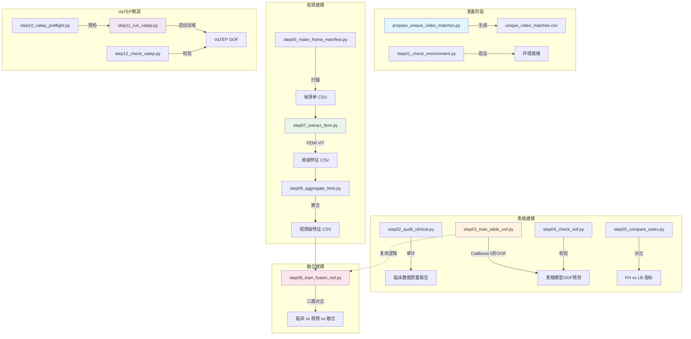

# 胚胎多模态实验：scripts/ 目录 Python 脚本完整指南

---

## 目录

- [整体汇总](#整体汇总)
  - [项目背景](#项目背景)
  - [数据流全景图](#数据流全景图)
  - [技术栈总览](#技术栈总览)
  - [脚本依赖关系](#脚本依赖关系)
  - [执行顺序](#执行顺序)
- [逐文件详解](#逐文件详解)
  - [common.py —— 公共基础模块](#commonpy--公共基础模块)
  - [prepare_unique_video_matches.py —— 生成 FEMI 唯一视频匹配表](#prepare_unique_video_matchespy--生成-femi-唯一视频匹配表)
  - [step01_check_environment.py —— 检查环境](#step01_check_environmentpy--检查环境)
  - [step02_audit_clinical.py —— 审计临床数据](#step02_audit_clinicalpy--审计临床数据)
  - [step03_train_table_oof.py —— 训练表格 OOF 模型](#step03_train_table_oofpy--训练表格-oof-模型)
  - [step04_check_oof.py —— 检查 OOF 合格性](#step04_check_oofpy--检查-oof-合格性)
  - [step05_compare_tasks.py —— 比较 FH 与 LB 任务](#step05_compare_taskspy--比较-fh-与-lb-任务)
  - [step06_make_frame_manifest.py —— 生成视频帧清单](#step06_make_frame_manifestpy--生成视频帧清单)
  - [step07_extract_femi.py —— 提取 FEMI 帧特征](#step07_extract_femipy--提取-femi-帧特征)
  - [step08_aggregate_femi.py —— 汇总 FEMI 视频特征](#step08_aggregate_femipy--汇总-femi-视频特征)
  - [step09_train_fusion_oof.py —— 融合模型对比](#step09_train_fusion_oofpy--融合模型对比)
  - [step10_vatep_preflight.py —— VaTEP 训练前检查](#step10_vatep_preflightpy--vatep-训练前检查)
  - [step11_run_vatep.py —— 安全启动 VaTEP 训练](#step11_run_vateppy--安全启动-vatep-训练)
  - [step12_check_vatep.py —— 检查 VaTEP OOF 结果](#step12_check_vateppy--检查-vatep-oof-结果)

---

## 整体汇总

### 项目背景

本项目是**试管婴儿（IVF）胚胎移植结局预测**的入门练习。目标是用两类数据预测胚胎移植后的两个临床结局：

| 标签 | 含义 | 说明 |
|---|---|---|
| **FH** (fetal heartbeat) | 胎心 | 移植后是否检测到胎儿心跳，短期结局 |
| **LB** (live birth) | 活产 | 是否最终活产，长期结局 |

输入数据分两路：
1. **临床表格数据**：10 个移植前可获得的数值指标（年龄、BMI、激素水平等）
2. **延时视频数据**：胚胎培养过程的延时摄影，通过 FEMI（Foundation Model for Embryo Image）提取视觉特征

整条流水线从纯表格建模逐步过渡到视频特征提取和融合建模，最终接入 VaTEP（Video-based Transformer for Embryo Prediction）预训练-微调范式。

### 数据流全景图



### 技术栈总览

| 层级 | 技术 | 用途 |
|---|---|---|
| 数据处理 | pandas, numpy, pathlib | 表格读写、清洗、路径操作 |
| 传统 ML | CatBoost (CatBoostClassifier) | 表格/融合模型的梯度提升树 |
| 交叉验证 | sklearn StratifiedGroupKFold | 按患者分组的五折分层 CV |
| 降维 | sklearn PCA + StandardScaler + SimpleImputer | 视频高维特征压缩到 32 维 |
| 深度学习 | PyTorch + HuggingFace Transformers (ViT) | FEMI 帧特征提取 |
| 图像处理 | PIL (Pillow) | 帧图像加载与预处理 |
| 评估指标 | sklearn roc_auc_score, average_precision_score | AUROC + AUPRC |
| 实验管理 | argparse, json, joblib | 参数化脚本、指标持久化、pipeline 序列化 |

### 脚本依赖关系

```
common.py  (被 6 个脚本导入)
  ├── step02_audit_clinical.py
  ├── step03_train_table_oof.py
  ├── step04_check_oof.py
  ├── step06_make_frame_manifest.py
  ├── step08_aggregate_femi.py
  └── step09_train_fusion_oof.py

prepare_unique_video_matches.py  (独立运行，产出 data/unique_video_matches.csv)

step01_check_environment.py      (独立运行)

step11_run_vatep.py              (读取并改写 embryo_live2 项目脚本，不依赖本项目其他脚本)
step10_vatep_preflight.py        (独立运行)
step12_check_vatep.py            (独立运行)
```

### 执行顺序

按步骤编号从 01 到 12 依次执行，其中：
- **step02** 必须在 **step03** 之前（先审计再建模）
- **step03** 必须在 **step04 / step05** 之前（先训练再检查/对比）
- **step06 → step07 → step08** 是视频特征提取管线，必须串行
- **step09** 依赖 step03 的训练逻辑和 step08 产生的视频特征
- **step10 → step11 → step12** 是 VaTEP 管线，必须串行
- `prepare_unique_video_matches.py` 在 step06 之前手动运行一次即可

---

## 逐文件详解

### common.py —— 公共基础模块

**定位**：全流程的"数据契约"，不单独运行，被 6 个业务脚本共享导入。

**核心功能**：

1. **常量集中管理**
   - `DEFAULT_CLINICAL`：临床表默认路径（`pathlib.Path` 类型）
   - `PATIENT` / `KEY`：患者 ID 和患者-胚胎唯一键的列名
   - `LABELS`：FH 和 LB 两个任务对应的标签列名映射
   - `CLINICAL_FEATURES`：10 个移植前数值临床特征列表（年龄、BMI、基础 FSH/LH/E2、AMH、Gn 总量、内膜厚度）

2. **`load_cohort(path, task)` —— 数据加载与清洗管道**
   - 参数校验（任务名白名单、必选字段检查）
   - 容错类型转换（`pd.to_numeric(..., errors="coerce")`，脏数据变 NaN）
   - 多条件过滤：二分类标签 + 有效患者 ID（排除空字符串/纯空格）+ 有效胚胎键
   - 按 `patient_embryo_key` 去重（保留首条）
   - **审计跟踪**：返回 `audit` 字典记录每步清洗前后的行数变化

3. **`metric_dict(y, probability)` —— 统一评估**
   - 同时返回 AUROC 和 AUPRC
   - 类别不平衡场景下 AUPRC 比 AUROC 更真实反映模型对少数类（成功妊娠）的排序能力
   - 输入统一转 `np.asarray`，免疫列表/Series/numpy 混用

**技术亮点**：
- `from __future__ import annotations` 延迟注解求值
- 完整的类型注解（`-> tuple[pd.DataFrame, str, dict]`）
- 防御式编程（fail-fast：缺字段直接抛清晰异常）

---

### prepare_unique_video_matches.py —— 生成 FEMI 唯一视频匹配表

**定位**：数据准备阶段的"桥梁脚本"，一次性运行，产生后续步骤依赖的匹配表。

**输入**：
- 安全视频-临床匹配表（`unique_safe_matches.csv`）：`match_key`, `patient_embryo_key`, `clean_patient_id`, `source_f0`
- FEMI 处理清单（`femi_processed_manifest.csv`）：`source_f0`, `processed_f0`, `n_frames_kept`, `trim_policy`

**处理流程**：
1. 校验两表必需字段
2. 按 `match_key` 去重（安全表原有 1154 行，去重后 1151 枚唯一胚胎）
3. `many_to_one` 左连接：安全表 join FEMI 处理清单
4. 校验所有视频的处理目录 (`processed_f0`) 在磁盘上真实存在
5. 输出 `unique_video_matches.csv` + `summary.json`

**输出字段**：`patient_embryo_key`, `clean_patient_id`, `match_key`, `embryo_dir`, `source_f0`, `processed_f0`, `n_frames_kept`, `trim_policy`

**技术亮点**：
- `validate="many_to_one"` 显式声明 join 基数约束，防止意外多对多膨胀
- 目录存在性校验：在写 CSV 之前就发现磁盘问题
- 同时输出结构化 JSON 摘要，便于下游程序化读取

---

### step01_check_environment.py —— 检查环境

**定位**：流程入口，30 行以内最简脚本，确保 Python 环境可用。

**功能**：打印 Python、PyTorch、pandas、scikit-learn、CatBoost 的版本号，检测 CUDA/GPU 是否可用。

**技术要点**：
- 直接 import 所有关键包，任何缺失都会在 import 阶段报 `ModuleNotFoundError`
- `torch.cuda.is_available()` + `get_device_name(0)` 确认 GPU 状态
- CatBoost 表格训练可不依赖 GPU，而 FEMI 提取和 VaTEP 训练必须用 GPU

---

### step02_audit_clinical.py —— 审计临床数据

**定位**：建模前的数据质量全面排查。

**处理流程**：
1. 读取原始临床表，校验 `PATIENT`、`KEY` 和 FH/LB 标签列是否存在
2. 统计全局信息：行数、列数、患者数、唯一胚胎键数、重复胚胎键数
3. 按任务统计标签分布：FH 的 0/1 计数、LB 的 0/1 计数
4. 生成逐列的审计报告：数据类型、缺失数、缺失率、唯一值数
5. 导出重复胚胎键的完整记录

**输出**：
| 文件 | 内容 |
|---|---|
| `dataset_summary.csv` | 行数、列数、患者数、标签分布 |
| `column_report.csv` | 每列的数据类型、缺失率、唯一值数（按缺失率降序） |
| `duplicate_embryo_keys.csv` | 重复胚胎键的完整记录 |

**技术亮点**：
- `value_counts(dropna=False)` 保留 NaN 计数，不遗漏缺失标签
- `sort_values("missing_rate", ascending=False)` 让高缺失列排在最前面，快速定位问题
- 结果写 CSV 而非仅在终端打印，方便后续查阅与自动化

---

### step03_train_table_oof.py —— 训练表格 OOF 模型

**定位**：纯临床表格建模的核心脚本，产生基准 OOF 预测。

**关键参数**：
| 参数 | 默认值 | 说明 |
|---|---|---|
| `--task` | 必选 `fh` 或 `lb` | 预测目标 |
| `--seed` | 2026 | 随机种子 |
| `--folds` | 5 | 交叉验证折数 |
| `--iterations` | 300 | CatBoost 迭代轮数 |

**处理流程**：
1. `load_cohort()` 加载并清洗数据，得到 `df`、标签 `y`、患者分组 `groups`
2. `StratifiedGroupKFold(n_splits=5)` 按患者分组做五折分层交叉验证
3. 每折训练一个 `CatBoostClassifier`（depth=4, lr=0.03, Logloss）并预测验证集
4. OOF 概率拼合成完整预测向量

**输出**（每折）：
| 文件 | 内容 |
|---|---|
| `model_fold{0-4}.cbm` | CatBoost 模型文件 |
| `oof_predictions.csv` | 每枚胚胎的 KEY, PATIENT, label, fold, oof_probability |
| `fold_metrics.csv` | 每折的 AUROC/AUPRC |
| `metrics.json` | 整体指标 + 审计信息 |
| `feature_columns.txt` | 使用的特征列表 |

**技术亮点**：
- **StratifiedGroupKFold**：按患者分组而非按胚胎分组——同一患者的多个胚胎不会跨折泄漏
- 双重断言：`assert set(train patients).isdisjoint(set(valid patients))` 和 `groupby(PATIENT)["fold"].nunique().max() == 1`
- `assert np.isfinite(oof).all()` 确保没有 NaN/Inf 预测
- `allow_writing_files=False` 禁止 CatBoost 生成临时分析文件

---

### step04_check_oof.py —— 检查 OOF 合格性

**定位**：对 step03 产出的 OOF 做全面质量校验。

**校验项**：
1. 必需字段存在（`KEY`, `PATIENT`, `label`, `fold`, `oof_probability`）
2. 胚胎键唯一，无重复
3. 无缺失预测
4. 概率值在 [0, 1] 范围内
5. 同一患者的所有胚胎在同一折（`groupby(PATIENT)["fold"].nunique().max() == 1`）
6. 复算 AUROC/AUPRC 并打印

**设计意图**：这是一个"门禁（gate）"脚本。如果检查不通过，step05 就不应该运行。它验证了 step03 的核心假设——患者分层没有泄漏。

---

### step05_compare_tasks.py —— 比较 FH 与 LB 任务

**定位**：最简对比脚本，并排展示 FH 和 LB 两个任务的指标。

**功能**：读取 FH 和 LB 各自的 `metrics.json`，以表格形式打印样本数、患者数、阳性数、AUROC、AUPRC。

**设计意图**：FH 是短期结局（样本多、阳性率高），LB 是长期结局（样本少、更稀疏），两者对比帮助理解任务难度差异。

---

### step06_make_frame_manifest.py —— 生成视频帧清单

**定位**：视频特征提取管线（step06→07→08）的第一步——从磁盘发现帧图像并生成清单。

**关键参数**：
| 参数 | 默认值 | 说明 |
|---|---|---|
| `--limit` | 5 | 处理的胚胎数（设为 0 则全量） |
| `--stride` | 20 | 帧采样间隔（每隔 N 帧取 1 帧） |

**处理流程**：
1. 读取 `unique_video_matches.csv`
2. 对每个胚胎目录递归搜索图像文件（`.jpg`, `.jpeg`, `.png`, `.bmp`）
3. 用 `natural_key` 自然排序（`frame_2` < `frame_10`）
4. 按 stride 间隔采样帧索引和路径
5. 输出清单 CSV

**输出字段**：`patient_embryo_key`, `clean_patient_id`, `frame_index`, `frame_path`

**技术亮点**：
- **自然排序**（`natural_key`）：`re.split(r"(\d+)", path.name)` 将数字部分按数值而非字典序排列，避免 `frame_10` 排在 `frame_2` 前面
- stride 采样大幅减少冗余帧，FEMI 提取成本与帧数成线性关系
- 用 `rglob("*")` 递归搜索，适配不同胚胎目录的内部子目录结构

---

### step07_extract_femi.py —— 提取 FEMI 帧特征

**定位**：视频特征提取管线的核心计算步骤——用预训练 ViT 提取每帧的视觉嵌入。

**关键参数**：
| 参数 | 默认值 | 说明 |
|---|---|---|
| `--model` | `ihlab/FEMI` | HuggingFace 模型 ID |
| `--batch-size` | 16 | 推理批大小 |
| `--device` | 自动检测 cuda/cpu | 计算设备 |

**处理流程**：
1. 读取帧清单 CSV，按 `patient_embryo_key` + `frame_index` 排序
2. 校验所有帧路径在磁盘存在
3. 加载 `AutoImageProcessor` + `AutoModelForPreTraining`（FEMI = 在胚胎图像上预训练的 ViT）
4. 如果模型配置中有 `mask_ratio`，设为 0（关闭 MAE 的随机掩码，只提取特征）
5. 分批推理：图像 → `processor` → `model.vit()` → 取 `last_hidden_state` → 去掉 CLS token → 空间均值池化 → 得到帧级嵌入向量
6. 每帧嵌入以 `femi_0000`, `femi_0001`, ... 命名，与帧元信息合并写入 CSV

**技术亮点**：
- `torch.inference_mode()` 替代 `no_grad()`，性能更优（禁用 autograd + 版本检查）
- `model.vit(...)` 而非 `model(...)`：跳过预训练头，仅取 ViT 编码器输出
- `hidden[:, 1:, :].mean(dim=1)`：去掉 [CLS] token 后对 patch 做均值池化，得到固定长度嵌入
- `mask_ratio = 0.0`：FEMI 基于 MAE 预训练，推理时需关闭掩码
- 逐批打印进度，长任务可追踪

---

### step08_aggregate_femi.py —— 汇总 FEMI 视频特征

**定位**：从帧级特征聚合为视频级特征，将不定长序列压缩为固定维度的输入向量。

**聚合策略**（对每个胚胎的所有帧）：

| 聚合名 | 计算方式 | 物理含义 |
|---|---|---|
| `mean` | 所有帧特征的均值 | 视频整体"平均外观" |
| `std` | 所有帧特征的标准差 | 视频的时序变化幅度 |
| `delta` | 后一半帧均值 - 前一半帧均值 | 胚胎发育趋势（前后半段差异） |
| `last` | 最后一帧特征 | 最终状态快照 |

**输出**：每个胚胎一行，特征列名如 `femi_mean_0000`, `femi_std_0000`, `femi_delta_0000`, `femi_last_0000`, ...

**技术亮点**：
- `cut = max(1, len(values) // 2)` 保证至少 1 帧在前半部分
- `np.float32` 精度，平衡内存与数值精度
- delta 特征捕捉发育动态——胚胎前后半段差异可能包含关键预后信息
- 聚合后特征维度 = 原帧特征维度 × 4

---

### step09_train_fusion_oof.py —— 融合模型对比

**定位**：同时运行三种建模策略并对比，回答"视频特征能否提升纯表格模型的预测能力"。

**三种模式** (`--mode`)：

| 模式 | 输入特征 | 说明 |
|---|---|---|
| `clinical` | 10 个临床特征 | 纯表格基准（与 step03 等价） |
| `video` | FEMI 视频特征 (PCA 降维到 32 维) | 纯视频信号 |
| `fusion` | 临床特征 + 视频 PCA 特征 | 多模态融合 |

**视频特征处理管线**（video / fusion 模式）：
```
原始 FEMI 特征 → SimpleImputer(median) → StandardScaler → PCA(32维)
```
PCA 在每折的训练集上 fit，验证集上 transform，避免数据泄漏。

**输出**（每折）：
| 文件 | 内容 |
|---|---|
| `model_fold{0-4}.cbm` | CatBoost 模型 |
| `video_pca_fold{0-4}.joblib` | PCA pipeline（video/fusion 模式） |
| `oof_predictions.csv` | OOF 预测 |
| `metrics.json` | 指标 + 匹配样本数 |

**技术亮点**：
- PCA 的 `n_components` 取 `min(pca_dim, train_n-1, raw_dim)` 的最小值，防止样本不足时 PCA 报错
- PCA pipeline 用 `joblib.dump` 序列化，包含 imputer + scaler + PCA 三步，推理时一个 `transform()` 搞定
- 三种模式共用同一套五折分组 CV 和 CatBoost 超参，确保对比公平
- 与 `load_cohort` 无缝衔接，clinical 和 video 通过 `patient_embryo_key` 做 inner join

---

### step10_vatep_preflight.py —— VaTEP 训练前检查

**定位**：VaTEP 训练的"起飞前检查单"，在真正启动训练前逐项确认环境就绪。

**检查项**：
| 检查项 | 失败后果 |
|---|---|
| CUDA GPU 可用 | 直接拒绝启动 |
| 临床表路径存在 | 列出缺失项 |
| ROI 图像目录存在 | 同上 |
| 预训练 encoder 权重 (`encoder.pth`) 存在 | 同上 |
| 两个训练脚本存在 | 同上 |
| 视频缓存目录及 `.npy` 文件数 | 信息打印 |
| `/home/zcy` 磁盘剩余空间 | 信息打印 |

**技术要点**：
- 用 `shutil.disk_usage` 检查磁盘空间，防止训练中途写满
- 所有路径存在性检查在一个列表里完成，用 `SystemExit` 统一报错
- 独立于项目其他脚本，直接读取原始数据路径

---

### step11_run_vatep.py —— 安全启动 VaTEP 训练

**定位**：安全包装器，在不修改原始实验项目代码的前提下，安全启动 VaTEP 训练。

**两种变体**：

| 变体 | 脚本 | 说明 |
|---|---|---|
| `lb` | `tune_vatep_lb_adapted.py` | LB 单任务微调 |
| `paper` | `tune_vatep_paper_adapted.py` | 论文版：FH + LB 联合微调 |

**两种运行模式**：

| 模式 | epochs | max_records | 用途 |
|---|---|---|---|
| `smoke` | 2 (debug) | 64 | 冒烟测试，验证代码能跑通 |
| `full` | 150 | 全量 | 正式训练 |

**安全机制**：
1. 检查输出目录是否已有 `oof_vatep_*.csv`，如有则拒绝覆盖
2. 将原始脚本**复制**到输出目录，**只改 `OUTPUT_DIR`** 一行——原始项目代码不受任何影响
3. 用 `shlex.join()` 把完整命令写入 `command.txt`，可审计可复现
4. 可 `--dry-run` 仅生成副本和命令不启动训练

**技术亮点**：
- 用 `str.replace(old, new, 1)` 只替换第一次出现的 `OUTPUT_DIR`，防止误改
- `subprocess.Popen` + 逐行转发到 stdout 和 log 文件：实时查看训练进度 + 完整日志留存
- `bufsize=1` 行缓冲，确保日志实时写入
- 冒烟模式用 `--debug-epochs 2 --max-records 64` 快速验证，正式模式用 `--epochs 150 --early-stop-patience 30`

---

### step12_check_vatep.py —— 检查 VaTEP OOF 结果

**定位**：VaTEP 训练后的结果验证，确保输出合法且指标有意义。

**检查项**：
1. OOF CSV 文件存在
2. 不存在重复的 `(patient_id, embryo_no)` 键
3. 按变体分别计算 AUROC：
   - `lb` 变体：标签 `label_LB` → 预测 `oof_prob_LB` 的 AUROC
   - `paper` 变体：FH 标签 AUROC + LB 标签 AUROC + LB 在 FH 子集上的 AUROC

**技术亮点**：
- `auc()` 函数在单类或全 NaN 时返回 `None` 而非崩溃，比直接调 `roc_auc_score` 更健壮
- `np.isfinite` 过滤 NaN/Inf 标签和预测值
- `paper` 变体的 FH 子集分析：只对 `is_FH_subset_for_MP_LB == True` 的样本计算 LB AUROC，评估"已知有胎心的胚胎中预测活产"的子任务难度

---

## 关键设计原则总结

1. **数据契约**：`common.py` 集中管理所有共享常量（列名、特征列表、标签映射），下游脚本不硬编码字段名
2. **审计透明**：每一步清洗前后行数变化都记录在 audit/metrics JSON 中
3. **患者分层**：所有交叉验证按患者分组（`StratifiedGroupKFold`），同一个患者的多个胚胎不会跨折
4. **安全启动**：VaTEP 训练通过复制脚本 + 只改 `OUTPUT_DIR` 实现隔离，绝不修改原始实验代码
5. **门禁检查**：step04、step10、step12 都是质量门禁，问题在早期暴露而非在后续步骤发现
6. **参数化**：所有脚本通过 `argparse` 接受命令行参数，便于不同配置的复现实验